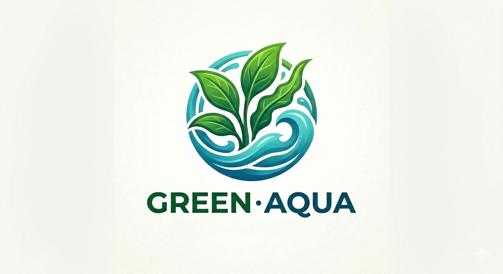

<!DOCTYPE html>
<html lang="en">
<head>
    <meta charset="UTF-8">
    <meta name="viewport" content="width=device-width, initial-scale=1.0">
    <title>Green Aqua - Aquatic Plants Store</title>
    
    
</head>
<body class="bg-aqua-green font-sans text-slate-900 min-h-screen flex flex-col">

    <nav class="bg-white text-slate-900 border-b border-aqua sticky top-0 z-50 shadow-sm">
        

            <a href="#" class="flex items-center gap-3">
                
                Green Aqua
            </a>
            <button onclick="toggleCart()" class="relative p-2 bg-emerald-50 hover:bg-emerald-100 text-emerald-900 rounded-full transition">
                🛒 0
            </button>
        

    </nav>

    <main class="max-w-6xl mx-auto px-4 py-8 flex-1 w-full">
        

            

                <h1 class="text-2xl font-bold text-emerald-950 mb-1">Premium Aquatic Plants</h1>
                
Select your plants and checkout directly via WhatsApp.

                
                

                    ⭐⭐⭐⭐⭐
                    4.9/5 (120+ Ratings)
                

            

            

                <input type="text" id="search-input" oninput="searchProducts()" placeholder="🔍 Search plants by name or details..." class="w-full px-4 py-2.5 rounded-xl border border-gray-300 focus:outline-emerald-700 bg-white shadow-sm text-sm">
            

        

        
        

            <button onclick="filterCategory('all', this)" class="px-4 py-2 rounded-full text-sm font-medium bg-emerald-800 text-white shadow-sm transition">
                All Plants
            </button>
            <button onclick="filterCategory('foreground', this)" class="px-4 py-2 rounded-full text-sm font-medium bg-white border border-gray-200 text-gray-700 hover:bg-gray-50 transition">
                Foreground
            </button>
            <button onclick="filterCategory('background', this)" class="px-4 py-2 rounded-full text-sm font-medium bg-white border border-gray-200 text-gray-700 hover:bg-gray-50 transition">
                Background
            </button>
            <button onclick="filterCategory('floating', this)" class="px-4 py-2 rounded-full text-sm font-medium bg-white border border-gray-200 text-gray-700 hover:bg-gray-50 transition">
                Floating Plants
            </button>
        

        

            

    </main>

    <footer class="bg-emerald-950 text-emerald-100 border-t border-emerald-900 mt-12">
        

            

                

                    
                    Green Aqua Plants
                

                
Your premium local source for high-quality foreground, background, and floating aquatic plants.

            

            

                <h4 class="text-white font-semibold text-sm tracking-wider uppercase">Contact Us</h4>
                
📞 Phone: 

                
📍 Address: 

            

        

        

            &copy; 2026 Green Aqua. All rights reserved.
        

    </footer>

    

        

            

                <h2 class="text-lg font-bold text-emerald-900">Your Shopping Cart</h2>
                <button onclick="toggleCart()" class="text-gray-500 hover:text-black text-2xl">&times;</button>
            

            
            

                

            

                <h3 class="text-sm font-semibold text-gray-700">Delivery Details:</h3>
                <input type="text" id="cust-name" placeholder="Customer Name" class="w-full p-2 border border-gray-300 rounded text-sm focus:outline-emerald-600">
                <input type="text" id="cust-address" placeholder="Delivery Address" class="w-full p-2 border border-gray-300 rounded text-sm focus:outline-emerald-600">
                
                <h3 class="text-sm font-semibold text-gray-700 pt-2">Payment Method:</h3>
                

                    <label class="flex items-center gap-2 text-sm cursor-pointer">
                        <input type="radio" name="payment-method" value="bank" checked onclick="handlePaymentChange('bank')" class="accent-emerald-700"> Bank Deposit
                    </label>
                    <label class="flex items-center gap-2 text-sm cursor-pointer">
                        <input type="radio" name="payment-method" value="cod" onclick="handlePaymentChange('cod')" class="accent-emerald-700"> Cash on Delivery (COD)
                    </label>
                

                

                    <input type="text" id="cust-nic" placeholder="NIC Number (ID Card)" class="w-full p-2 border border-emerald-300 bg-emerald-50/50 rounded text-sm focus:outline-emerald-600">
                

                
                

                    <h3 class="text-sm font-semibold text-gray-700 mb-1">Shopping Experience Survey:</h3>
                    
Are you satisfied with our online store system?

                    

                        <label class="flex items-center gap-1 text-xs cursor-pointer text-gray-700">
                            <input type="radio" name="satisfaction" value="Highly Satisfied 😍" checked class="accent-emerald-700"> Highly Satisfied 😍
                        </label>
                        <label class="flex items-center gap-1 text-xs cursor-pointer text-gray-700">
                            <input type="radio" name="satisfaction" value="Satisfied 🙂" class="accent-emerald-700"> Satisfied 🙂
                        </label>
                        <label class="flex items-center gap-1 text-xs cursor-pointer text-gray-700">
                            <input type="radio" name="satisfaction" value="Neutral 😐" class="accent-emerald-700"> Neutral 😐
                        </label>
                    

                

            

            

                <h4 class="text-xs font-bold text-emerald-900 tracking-wider uppercase mb-1">🏦 Bank Deposit Details</h4>
                
Bank: Commercial Bank

                
Account No: 8001XXXXXX

                
⚠️ Please send the deposit slip screenshot in the WhatsApp chat.

            

            

                <h4 class="text-xs font-bold text-amber-900 tracking-wider uppercase mb-1">📦 Cash on Delivery Rules</h4>
                
Order will be verified using your NIC. Please pay the cash directly to the courier agent upon delivery.

            

            

                

                    Total Amount:
                    LKR 0.00
                

                <button onclick="sendToWhatsApp()" class="w-full bg-emerald-600 text-white py-3 rounded-lg font-medium hover:bg-emerald-700 transition flex items-center justify-center gap-2 shadow">
                    💬 Send Order via WhatsApp
                </button>
            

        

    

    

        

            <button onclick="closeDetails()" class="absolute top-3 right-3 bg-black/50 hover:bg-black/70 text-white w-8 h-8 rounded-full flex items-center justify-center z-10 font-bold transition">&times;</button>
            
            
            
            

                
                <h2 id="modal-name" class="text-2xl font-bold text-emerald-950 mt-2"></h2>
                

                
                

                
                

                    

                        Light
                        
                    

                    

                        CO2
                        
                    

                    

                        Growth
                        
                    

                

            

            
            

                <button id="modal-add-btn" class="flex-1 bg-emerald-800 text-white py-3 rounded-xl font-medium hover:bg-emerald-900 transition shadow">
                    + Add to Cart
                </button>
            

        

    

    
</body>
</html>
